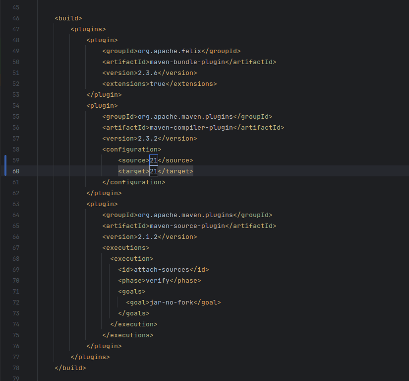
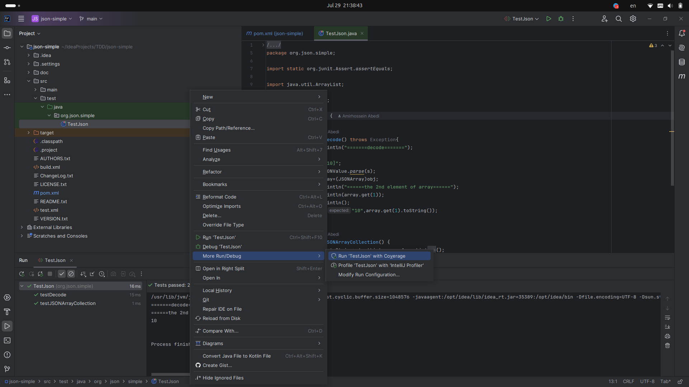
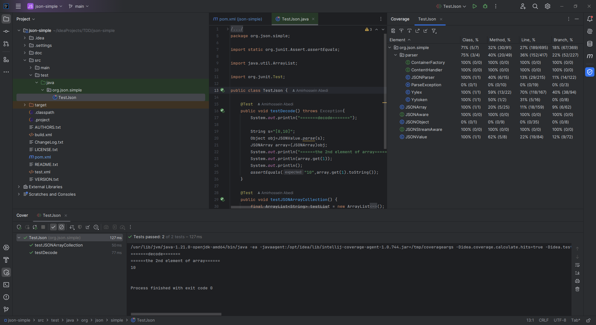
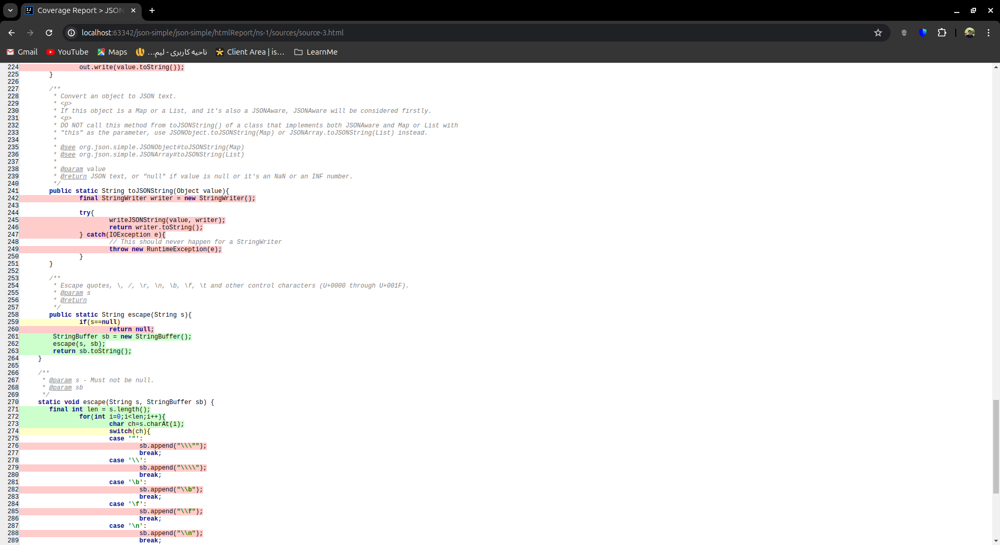

# TDD
TDD experiment for Software Enginnering Lab Course @ SUT.

اعضای تیم:
- همراز عرفاتی ۹۹۱۰۹۷۹۹
- امیرحسین براتی ۹۹۱۰۱۳۰۸
- امیرحسین عابدی ۹۹۱۰۵۵۹۴

## بخش اول: JUnit, Coverage

در این بخش بایستی با توجه به مراحل گفته شده، مقدار کدی که توسط تست‌ها پوشش داده می‌شود را به دست بیاوریم. در ابتدا نسخه جاوای پروژه را با توجه به 
SDK
خودمان تغییر می‌دهیم. برای اعمال این تغییر باید در فایل
`pom.xml`
این تغییر را اعمال کنیم:

اکنون در 
Intellij
به فایل
`TestJson.java`
می‌رویم و روی 
Run Test With Coverage
کلیک می‌کنیم.

اکنون در سمت راست 
IDE 
درصد کد پوشش داده شده در هر کدام از فایل‌ها به ترتیب نوشته شده است:

حال با کلیک روی 
Generate Coverage Report
یک خروجی 
html
برای پوشش تست‌های خودمان ایجاد می‌کنیم. پس از این کار فایل
`index.html`
ایجاد شده در پوشه
`htmlReport`
را در مرورگر باز می‌کنیم.

## بخش دوم: پیدا کردن ۲ ایراد و توسعه Library
در ابتدا تست‌های مربوط به Student و Book را اضافه می‌کنیم. اما همانطور که انتظار داشتیم چون توابع این کلاس‌ها اکثرا از جنس getter و setter ها هستند و منطق زیادی را پیاده‌سازی نمی‌کنند تمام تست‌های این دو کلاس پاس شدند.

حال به فایل library می‌رویم که بیشتر منطق برنامه در این فایل پیاده‌سازی شده است. تست return و lend را به برنامه اضافه می‌کنیم
همانطور که می‌بینیم تست‌ها در خط ۲۴ و ۴۹ فیل می‌شوند.

خط ۲۴ مربوط به زمانی است که کتاب به کسی داده می‌شود که هنوز رجیستر نشده است و باید تابع کار نکند و خط ۴۹ مربوط به این است که بعد از return کردن کتاب به کتابخانه، آن کتاب دیگر نباید در لیست کتاب‌های آن شخص وجود داشته باشد. بنابراین این دو ایراد در برنامه وجود دارند:
- کتاب ممکن است به کسی قرض داده شود که هنوز رجیستر نشده‌ است.
- بعد از پس داده شدن کتاب توسط یک شخص، کتاب از لیست کتاب‌های او حذف نمی‌شود.

این اشکالات را در فایل Library اصلاح می‌کنیم و بار دیگر تست‌ها را ران می‌کنیم.

در ادامه می‌خواهیم توابعی که در Library ناقص هستند را کامل کنیم. قبل از اینکه این توابع را کامل کنیم تست‌هایی می‌نویسیم که مشخص می‌کنند از این توابع چه انتظاراتی داریم. بعد از اضافه کردن تست‌ها همانطور که انتظار داشتیم تمامی آن‌ها fail می‌شوند.

حال با اضافه کردن خطوط کد به توابع درون Library تست‌ها را پاس می‌کنیم. در ابتدا تابع StudentSearch را تکمیل می‌کنیم که سرچ را بر روی دانش‌آموزان انجام می‌دهد و بعد چک می‌کنیم که تست‌ها پاس شده‌اند یا خیر

با پاس شدن تست‌های StudentSearch به سمت BookSearch می‌رویم و تابع آن را هم تکمیل می‌کنیم. در نهایت با تکمیل کردن این تابع تمامی تست‌ها پاس می‌شوند.

## سوالات

۱. روش TDD بر این تمرکز دارد که در ابتدا تست‌ها نوشته شوند و بعد ارورهای کامپایل برطرف شوند و بعد تست‌ها موفقیت‌آمیز باشند. روش سنتی تست نوشتن این است که ابتدا کد نوشته شود و بعد از آن تست‌ها نوشته شوند. TDD به طور کلی برای زمان‌هایی مناسب است که پروژه‌ای بزرگ و با بازه زمانی زیاد در حال انجام است و ما در حال ساخت و یا توسعه آن هستیم. در اینصورت متود TDD بسیار به کمک ما خواهد آمد چرا که می‌توانیم به راحتی کد موردنظر را develop و maintain کنیم. همینطور در پروژه‌هایی که درستی باید تضمین شده باشد اپروچ TDD خیلی بهتر از اپروچ سنتی است چرا که در هر قدم از درستی کد مطمئن هستیم.

اما مواقعی هم وجود دارد که این رویکرد نسبت به رویکرد سنتی بهتر نیست. به طور مثال مواقعی که می‌خواهیم یک پروژه کوچک شخصی انجام دهیم و یا مواقعی که وقت زیادی نداریم بهتر است که از اپروچ سنتی استفاده کنیم و صرفا یک محصول MVP بسازیم. همچنین در مواقعی که با یک کدبیس زیاد و قدیمی طرف هستیم، آوردن این سیستم به متود TDD ممکن است باعث بوجود آمدن چالش شود و بهتر است صرفا به آن تست‌هایی که می‌خواهیم را اضافه کنیم.

۲. تیم development از unit test ها استفاده می‌کنند که از طریق آن متوجه می‌شوند که هر تکه از کد درست کار می‌کند و از ابزار های اتوماسیون برای آن استفاده می‌کنند. تیم QA بیشتر تمرکز را بر روی کلیات می‌گذارند و تست می‌کنند که آیا یک نرم‌افزار به طور کلی درست کار می‌کند یا خیر. این ابزارها می‌توانند دستی یا اتوماتیک باشند و همینطور غیر از درستی این تیم چک می‌کند که برنامه درست develop و deploy شده باشد. تیم development همیشه در حال انجام یونیت‌ تست‌ها هستند اما تیم QA هنگام ریلیز یک نسخه این کار را انجام می‌دهد. همچنین تیم development از دیدگاه تکنیکال به تست نگاه می‌کنند اما تیم QA از دیدگاه یک یوزر به برنامه نگاه می‌کنند و تست می‌کنند که برنامه کیفیت لازم را داشته باشد.

۳. همانطور که برای json-simple استفاده کردیم از این پروژه هم coverage می‌گیریم.

می‌بینیم که در بعضی قسمت‌ها مانند شکل زیر استفاده‌ای نشده است. سعی می‌کنیم تست‌هایی بسازیم که این قسمت‌ها را پوشش دهند.

۴. بعد از اضافه شدن تست‌ها عدد coverage به صورت زیر می‌باشد

